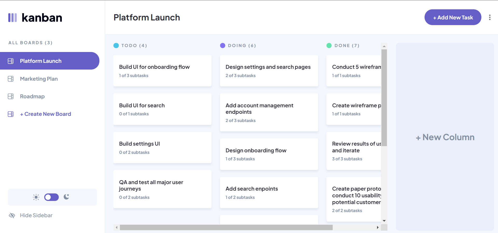

# Kanban task management web app

## Table of contents

- [Overview](#overview)
  - [The challenge](#the-challenge)
  - [Screenshot](#screenshot)
  - [Links](#links)
- [My process](#my-process)
  - [Built with](#built-with)
  - [What I learned](#what-i-learned)
  - [Useful resources](#useful-resources)
- [Author](#author)

## Overview

### The challenge

Users are able to:

- View the optimal layout for the app depending on their device's screen size
- See hover states for all interactive elements on the page
- Create, read, update, and delete boards and tasks
- Receive form validations when trying to create/edit boards and tasks
- Mark subtasks as complete and move tasks between columns
- Hide/show the board sidebar
- Toggle the theme between light/dark modes

Yet todo:

- Allow users to drag and drop tasks to change their status and re-order them in a column
- Build this project as a full-stack application

### Screenshot

### Links

- [Github repo URL](https://github.com/Danny-Lenko/r-fm-kanban-management)
- Live Site URL: [Add live site URL here](https://your-live-site-url.com)

## My process

### Built with

- [React](https://reactjs.org/) - JS library
- [TS](https://www.typescriptlang.org/) - JS superset programming language
- [Redux](https://redux.js.org/) - JS apps state manager
- [MUI](https://mui.com/) - React UI framework
- [Formik](https://formik.org/) - React form librar

### What I learned

1) [StackOverflow](https://stackoverflow.com/a/38750895/16906724) - Filter object properties by key in ES6.
2) [StackOverflow](https://stackoverflow.com/a/3416472/16906724) - How to make an empty div take space?
3) [StackOverflow](https://stackoverflow.com/a/58223758/16906724) - React Formik use submitForm outside <Formik />
4) [StackOverflow](https://stackoverflow.com/a/71135482/16906724) - How to use material UI Checkbox with formik?
5) [StackOverflow](https://stackoverflow.com/a/74153277/16906724) - SVG Checkbox remove padding

### Useful resources

- [Frontend mentor](https://www.frontendmentor.io) - The best practicing platform for frontend devs. Different level projects with the possibility to choose between more CSS or JS focused tasks.
- [Scrimba](https://scrimba.com) - Frontend coding school with a constantly growing friendly community and the unique interactive way of study.
- [FreeCodeCamp](https://www.freecodecamp.org/) - The biggest English coding community, dozens of articles on each topic.

## Author

<!-- - My Portfolio - [Danny Lenko]() -->
- LinkedIn - [ValeriiDanylenko](https://www.linkedin.com/in/valerii-danylenko-74379212b/)
- Github - [Danny-Lenko](https://github.com/Danny-Lenko)
- Facebook - [Valerii Danylenko](https://www.facebook.com/valerii.danylenko)